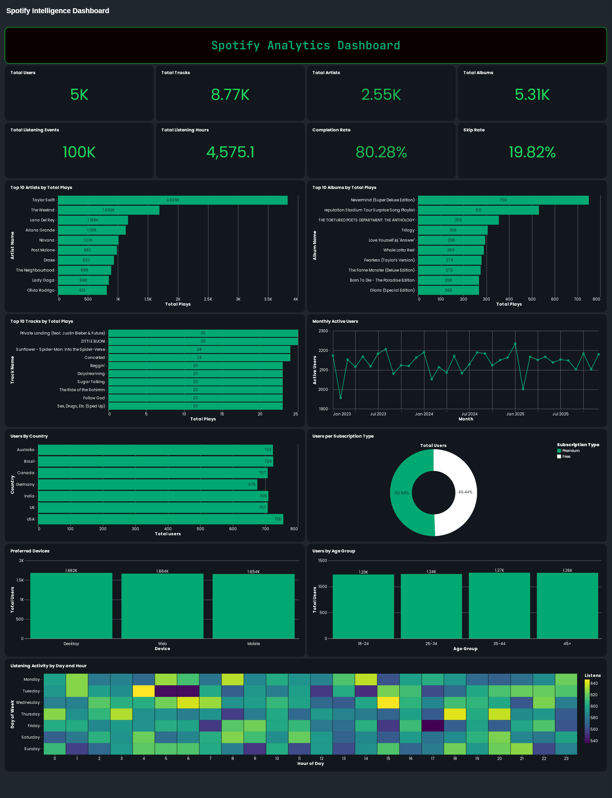

# 🎵 Spotify Listening Analytics

> An end-to-end **Data Engineering & Data Analytics** project demonstrating a modern **Lakehouse Architecture** using Python, Pandas, PySpark, SQL, and Databricks.

---

## 📌 Project Overview

This project transforms raw Spotify listening events into actionable business insights through a structured data engineering pipeline. It demonstrates both data engineering and analytics expertise by implementing a complete medallion architecture (Bronze → Silver → Gold) with dimensional modeling and interactive dashboards.

**Key Capabilities:**
- Ingest and process Spotify track data at scale
- Implement medallion architecture for progressive data refinement
- Design and maintain a star schema for analytical queries
- Generate business intelligence dashboards
- Calculate comprehensive KPIs for platform engagement metrics

---

## 🎯 Business Objectives

This project answers critical business questions:

- 🎤 Which artists, tracks, and albums drive the highest engagement?
- 🌍 How does listening behavior vary across countries and devices?
- 👥 What are the platform's Monthly Active Users (MAU)?
- 📊 How do listening trends evolve over time?
- 📈 Which KPIs best represent platform engagement?

---

## 🛠️ Technology Stack

| Category | Technologies |
|----------|--------------|
| **Programming** | Python |
| **Data Processing** | Pandas, PySpark |
| **Data Platform** | Databricks Lakehouse |
| **Query Language** | SQL |
| **Data Architecture** | Star Schema, Medallion Architecture |
| **Visualization** | Databricks Dashboards |
| **Version Control** | Git & GitHub |

---

## 🏗️ Solution Architecture

The project implements the **Medallion Architecture** pattern to progressively refine raw Spotify data into business-ready analytical datasets.

### 🥉 Bronze Layer
- Ingest raw Spotify dataset into Databricks
- Preserve original data without transformations
- Serves as the single source of truth

### 🥈 Silver Layer
- Clean and validate raw data
- Handle missing values and duplicates
- Create dimensional data model
- Build fact and dimension tables for analytics

### 🥇 Gold Layer
- Aggregate business metrics
- Generate KPI tables
- Prepare analytical datasets for dashboards
- Enable fast and efficient business reporting

### 📊 Dashboard Layer
- Executive KPI Dashboard
- Content Performance Analytics
- Audience Analytics
- Listening Trend Analysis

  

---

## ⭐ Star Schema Design

The Silver layer implements a **Star Schema** for efficient analytical queries, consisting of:

### Fact Table
- **fact_listening_events** — Core listening activity records

### Dimension Tables
- **dim_tracks** — Track metadata
- **dim_artists** — Artist information
- **dim_albums** — Album details
- **dim_users** — User attributes

This design minimizes data redundancy while enabling fast analytical queries.

  

---

## 📊 Dashboard

  

---

## 📈 Key Performance Indicators

The dashboard tracks essential business metrics across four dimensions:

**User & Content Metrics:**
- Total Users
- Total Artists
- Total Albums
- Total Tracks
- Total Listening Events

**Engagement Metrics:**
- Monthly Active Users (MAU)
- Listening Hours
- Completion Rate
- Skip Rate

**Content Performance:**
- Top Artists
- Top Tracks
- Top Albums

**User Segmentation:**
- Country-wise User Distribution
- Device Usage
- Subscription Distribution

**Trend Analysis:**
- Daily Listening Trend
- Monthly Listening Trend

---

## 💡 Key Learnings & Skills Demonstrated

Through this project, I gained hands-on expertise in:

✅ **Data Architecture:** Designing medallion architecture (Bronze, Silver, Gold)  
✅ **Dimensional Modeling:** Building star schemas for analytical warehouses  
✅ **Data Processing:** Processing large-scale data using PySpark  
✅ **Analytics:** Performing transformations and generating insights using SQL  
✅ **Data Quality:** Implementing validation and cleansing techniques  
✅ **Business Analytics:** Translating requirements into actionable KPIs  
✅ **Visualization:** Creating interactive dashboards in Databricks  

---

## 🚀 Project Highlights

- ✨ End-to-end Lakehouse analytics solution using Databricks
- 🏗️ Medallion architecture with Bronze, Silver, and Gold layers
- 📐 Star Schema design for optimized analytical queries
- 🔄 Synthetic listening events simulating real user activity
- 🎯 Business-ready Gold tables for immediate use
- 📊 Interactive executive dashboard with comprehensive insights
- ✔️ Data quality validation and dimensional modeling best practices

---

## 📝 License

This project is open source and available for educational purposes.

---

**Thank you for visiting! 🙏**
