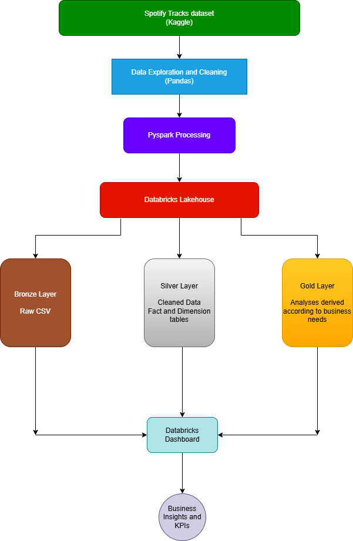
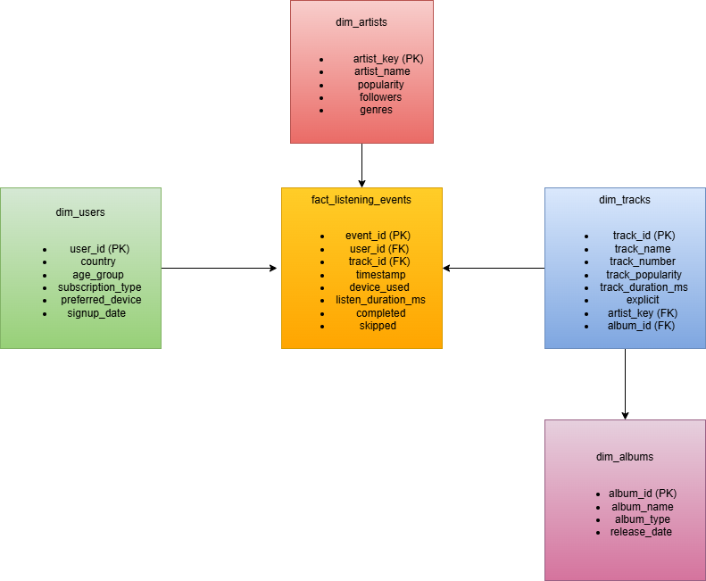

#  Spotify Listening Intelligence Platform

> An end-to-end Data Engineering and Data Analytics project built using **Python, Pandas, PySpark, SQL, and Databricks**. The project follows a modern **Lakehouse Architecture (Bronze → Silver → Gold)** to transform raw Spotify data into business-ready insights and interactive dashboards.

## 📌 Project Overview

Spotify generates millions of listening events every day. Turning this raw event data into meaningful business insights requires a structured data engineering pipeline and a well-designed analytical data model.

This project demonstrates an end-to-end analytics workflow by ingesting Spotify track data, transforming it using a Medallion (Bronze–Silver–Gold) architecture, designing a star schema for analytics, and building interactive dashboards in Databricks.

The project showcases both **Data Engineering** and **Data Analytics** skills by combining Python, Pandas, PySpark, SQL, dimensional modeling, and business intelligence reporting.

## 🎯 Business Objectives

The project aims to answer key business questions such as:

- Which artists, tracks, and albums generate the highest engagement?
- How does listening behaviour vary across countries and devices?
- What are the platform's Monthly Active Users (MAU)?
- How do listening trends change over time?
- Which KPIs best represent platform engagement?

## 🛠️ Technology Stack

| Category | Technologies |
|----------|--------------|
| Programming | Python |
| Data Processing | Pandas, PySpark |
| Data Warehouse | Databricks Lakehouse |
| Query Language | SQL |
| Data Modeling | Star Schema, Medallion Architecture |
| Dashboard | Databricks Dashboard |
| Version Control | Git & GitHub |

## 🏗️ Solution Architecture

The project follows the **Medallion Architecture (Bronze → Silver → Gold)** to progressively refine raw Spotify data into business-ready analytical datasets.

### Bronze Layer
- Ingest raw Spotify dataset into Databricks.
- Preserve the original dataset without transformations.
- Acts as the single source of truth.

### Silver Layer
- Clean and validate raw data.
- Handle missing values and duplicates.
- Create dimensional data model.
- Build fact and dimension tables for analytics.

### Gold Layer
- Aggregate business metrics.
- Generate KPI tables.
- Prepare analytical datasets for dashboards.
- Enable fast and efficient business reporting.

### Dashboard Layer
- Executive KPI Dashboard
- Content Performance Analytics
- Audience Analytics
- Listening Trend Analysis

---

  

## ⭐ Star Schema

The Silver layer follows a **Star Schema** consisting of one fact table and four dimension tables.

### Fact Table

- **fact_listening_events**

### Dimension Tables

- **dim_tracks**
- **dim_artists**
- **dim_albums**
- **dim_users**

This dimensional model enables efficient analytical queries while minimizing data redundancy.

  

## 📈 Key Performance Indicators

The dashboard tracks the following business metrics:

- Total Users
- Total Artists
- Total Albums
- Total Tracks
- Total Listening Events
- Monthly Active Users (MAU)
- Listening Hours
- Completion Rate
- Skip Rate
- Top Artists
- Top Tracks
- Top Albums
- Country-wise User Distribution
- Device Usage
- Subscription Distribution
- Daily Listening Trend
- Monthly Listening Trend

## 💡 Key Learnings

Through this project I gained hands-on experience with:

- Designing a Medallion Architecture (Bronze, Silver, Gold)
- Building a dimensional data warehouse using Star Schema
- Processing data using PySpark
- Performing analytical transformations using SQL
- Creating business-ready Gold tables
- Designing interactive dashboards in Databricks
- Applying data quality validation techniques
- Translating business requirements into analytical KPIs

## 🚀 Project Highlights

- Built an end-to-end Lakehouse analytics solution using Databricks.
- Implemented Bronze, Silver, and Gold data architecture.
- Designed a Star Schema for analytical reporting.
- Generated synthetic listening events to simulate user activity.
- Built business-ready Gold tables using SQL.
- Developed an interactive executive dashboard with Databricks.
- Applied data quality validation and dimensional modeling best practices.

THANK YOU!!!!
